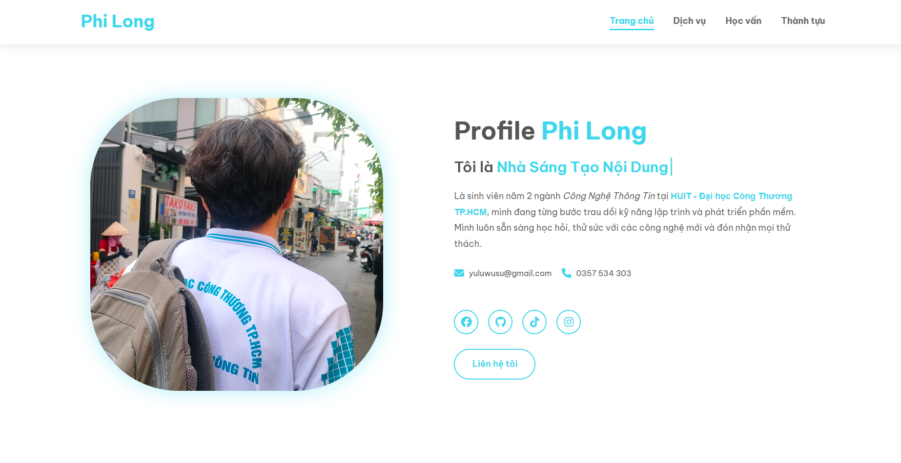

# Portfolio Website Template - Professional Personal Website

   

A modern, fully responsive portfolio website template built with pure HTML, CSS, and JavaScript. Perfect for developers, designers, students, and professionals to showcase their skills, projects, and achievements.

## 🎯 Features

### 🚀 **Modern & Professional Design**
- **Fully Responsive**: Works perfectly on all devices (Desktop, Tablet, Mobile)
- **Modern UI/UX**: Clean, minimal, and professional interface
- **Performance Optimized**: Fast loading with optimized assets
- **Cross-Browser Compatible**: Works on Chrome, Firefox, Safari, Edge

### 📱 **Complete Sections Included**
1. **Hero Section** 
   - Animated typing text effect
   - Profile image with hover effects
   - Social media links
   - Contact information

2. **Services Section**
   - Interactive service cards with status indicators
   - Pricing information
   - Feature tags
   - Call-to-action buttons

3. **Education & Profile Section**
   - Professional CV-style layout
   - Two-column responsive design
   - Skills visualization
   - Academic achievements
   - Language proficiency indicators

4. **Achievements Section**
   - Project/achievement cards
   - Category tags
   - Date indicators
   - Image galleries

### 🎨 **Design Features**
- **Custom Color Palette**: Blue-based professional theme
- **Typography**: Modern font pairing (Poppins + Arial)
- **Interactive Elements**: Hover effects, smooth transitions
- **Visual Hierarchy**: Clear content organization
- **Accessibility**: ARIA labels and semantic HTML

## 🖼️ Preview

### Desktop View


### Mobile View


## 📂 Project Structure

```
portfolio-template/
│
├── index.html              # Main HTML file
│
├── css/                   # Stylesheets
│   ├── home.css          # Home section styles
│   ├── education.css     # Education section styles
│   ├── achievement.css   # Achievements section styles
│   ├── services.css      # Services section styles
│   └── responsive.css    # Responsive styles
│
├── javascript/           # JavaScript files
│   └── portfolio.js     # Main JavaScript functionality
│
├── images/              # Image assets
│   ├── PhiLong.jpg     # Profile image
│   ├── favicon.ico     # Favicon
│   ├── Achiv1-5.jpg    # Achievement images
│   └── preview/        # Preview screenshots
│
├── README.md            # This file
└── LICENSE              # MIT License
```

## 🛠️ Installation

### Option 1: Quick Start (GitHub Pages)
1. **Fork** this repository
2. **Clone** your fork:
   ```bash
   git clone https://github.com/YuluWusu/portfolio-website-design
   ```
3. **Open** `index.html` in your browser

### Option 2: Manual Setup
1. Download the ZIP file
2. Extract to your desired location
3. Open `index.html` in any modern browser

### Option 3: Deploy to Netlify/Vercel
1. Push to GitHub
2. Connect to Netlify/Vercel
3. Deploy with one click

## ⚙️ Customization Guide

### 1. Personal Information
Edit `index.html` to replace:
- **Name**: "Phi Long" → Your Name
- **Email**: `yuluwusu@gmail.com` → Your Email
- **Phone**: `0357 534 xxx` → Your Phone
- **Images**: Replace in `images/` folder

### 2. Content Modification
#### Home Section
```html
<!-- Line 42-49 in index.html -->
<h1>Profile <span>Your Name</span></h1>
<h3 class="typing-text">I am a <span>Developer</span></h3>
<p>Your introduction here...</p>
```

#### Services Section
```html
<!-- Line 68-120 in index.html -->
<div class="service-row">
    <div class="service-icon">
        <i class="fas fa-code"></i> <!-- Change icon -->
    </div>
    <div class="service-content">
        <h3>Your Service Title</h3>
        <p>Service description...</p>
        <div class="service-features">
            <span class="feature-tag">Feature 1</span>
            <span class="feature-tag">Feature 2</span>
        </div>
    </div>
</div>
```

#### Education Section
```html
<!-- Line 166-212 in index.html -->
<div class="info-item">
    <div class="info-label">Field</div>
    <div class="info-value">Your Value</div>
</div>
```

### 3. Color Scheme Customization
Edit `css/` files to change colors:

```css
/* In education.css */
:root {
    --primary-color: #3fd7eb;      /* Main blue */
    --secondary-color: #2c3e50;    /* Dark blue */
    --accent-color: #27ae60;       /* Green */
    --warning-color: #ff9800;      /* Orange */
    --background-color: #ffffff;   /* White */
    --card-background: #e6f7ffb4;  /* Light blue */
}
```

### 4. Adding New Sections
1. Copy section structure from existing sections
2. Add CSS styles in appropriate CSS file
3. Update navigation menu
4. Link new CSS if needed

## 🎨 Color Palette

| Color | Hex | Usage |
|-------|-----|-------|
| Primary Blue | `#3fd7eb` | Main accent, buttons, highlights |
| Dark Blue | `#2c3e50` | Headers, important text |
| Light Blue | `#e6f7ffb4` | Backgrounds, cards |
| Success Green | `#27ae60` | Scores, positive indicators |
| Warning Orange | `#ff9800` | Awards, attention items |
| White | `#ffffff` | Backgrounds, text contrast |
| Gray | `#7f8c8d` | Secondary text, labels |

## 📱 Responsive Breakpoints

| Breakpoint | Device | Layout |
|------------|--------|--------|
| `480px` | Mobile | Single column, hamburger menu |
| `768px` | Tablet | Adjusted spacing, stacked sections |
| `992px` | Small Desktop | Multi-column layouts |
| `1200px+` | Desktop | Full features, optimal spacing |

## 🔧 Technologies Used

- **HTML5**: Semantic markup
- **CSS3**: Flexbox, Grid, Animations
- **JavaScript**: DOM manipulation, interactivity
- **Font Awesome**: Icons
- **Google Fonts**: Typography

## ✨ JavaScript Features

- **Navigation**: Smooth scrolling, active section highlighting
- **Mobile Menu**: Hamburger menu toggle
- **Typing Effect**: Animated text typing
- **Interactive Cards**: Hover effects and transitions

## 🚀 Performance Optimization

1. **Image Optimization**: Compressed images for fast loading
2. **CSS Minification**: Minified in production
3. **Lazy Loading**: Images load as needed
4. **Cache Optimization**: Proper cache headers

## 📝 SEO Features

- Semantic HTML5 markup
- Meta tags for description and keywords
- Open Graph tags for social sharing
- Structured data for rich snippets
- Mobile-friendly design
- Fast loading times

## 🤝 Contributing

Contributions are welcome! Here's how:

1. Fork the repository
2. Create a feature branch (`git checkout -b feature/AmazingFeature`)
3. Commit your changes (`git commit -m 'Add some AmazingFeature'`)
4. Push to the branch (`git push origin feature/AmazingFeature`)
5. Open a Pull Request

### Development Guidelines
- Follow existing code style
- Add comments for complex logic
- Test on multiple devices
- Update documentation as needed

## 📄 License

This project is licensed under the MIT License - see the [LICENSE](LICENSE) file for details.

## 👥 Authors & Contributors

- **Hoàng Xuân Phi Long** - Initial work
- **Contributors** - See [contributors](https://github.com/YuluWusu)

## 🙏 Acknowledgments

- Thanks to all open-source libraries used
- Inspiration from various portfolio designs
- Community support and feedback
- Testers and users who provided valuable feedback

## 🌟 Showcase

Want to be featured? Share your customized version:
1. Create an issue with "Showcase" label
2. Include your live URL
3. Mention unique features you added

## 📞 Support

- **Issues**: [GitHub Issues](https://github.com/YuluWusu/portfolio-website-design/issue)
- **Email**: yuluwusu@gmail.com
- **Documentation**: [Wiki](https://github.com/YuluWusu/portfolio-website-design/wiki)

---

⭐ **If you find this template useful, please give it a star!** ⭐

*Happy coding! Build something amazing!* 🚀

---

## 🔗 Quick Links

- [Live Demo](#) *(Add your live URL here)*
- [Documentation](docs/) *(If you create documentation)*
- [Changelog](CHANGELOG.md) *(Track changes)*
- [Contributing Guide](CONTRIBUTING.md) *(How to contribute)*
- [Code of Conduct](CODE_OF_CONDUCT.md) *(Community guidelines)*

